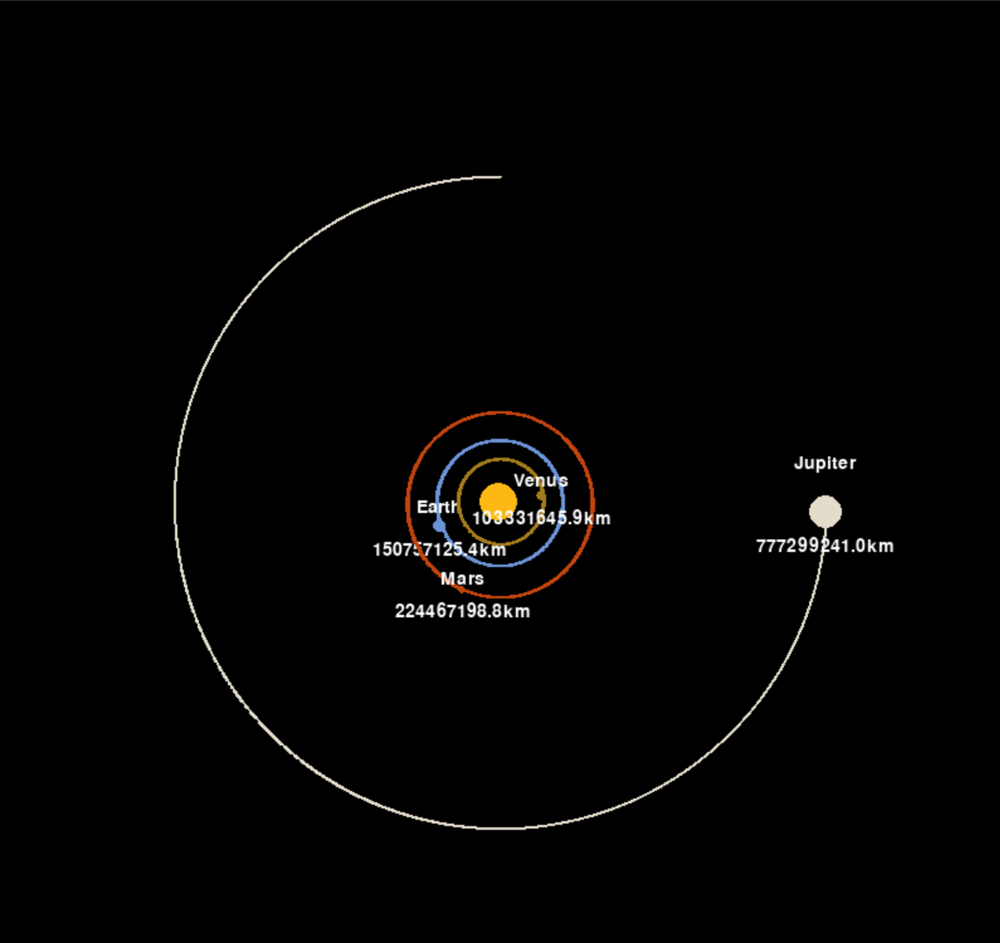

# Solar-System-Simulation
My first programming project. I made it in python using the pygame library after learning about gravity in highschool physics.
Although there are only planets up to Jupiter so that all the planets present can be seen, a future plan of mine is to posibly revisit this and add some extra features and the include more planets and maybe moons.
